# ☁️ AWS PracCloud - Android App

**AWS PracCloud** is an educational Android app designed to help users prepare for the **AWS Cloud Practitioner certification**. It offers 11 structured modules, interactive quizzes, service overviews, and helpful features like eBook download and user history tracking — all with a clean, intuitive UI.

---

## 🎯 Project Objective

The primary goal of this app is to provide a **structured, interactive, and offline-capable** learning experience for cloud beginners. It is especially useful for students preparing for the AWS Cloud Practitioner exam.

---

## ✨ Key Features

- 🔐 **Secure Login/Register** with SQLite and SharedPreferences
- 📚 **Start Preparation** with 11 AWS modules + Assessment, using WebView to show structured HTML content
- 🗃️ **Services Overview** section to explore AWS services in a clean table format
- 📝 **Quiz Module** with 10 MCQ questions per quiz, and score tracking
- 📈 **Quiz History** screen to view past attempts and scores
- 📖 **eBook Download** feature for offline study
- 🧑‍💼 **Profile screen** showing user details
- 🧭 **Sidebar Menu** with About Us, Share App, Rate App, Contact Us
- 🔄 **Bottom Navigation Bar** for easy navigation between Home, Quiz, and Profile

---

## 🛠 Technologies Used

- **Android** (Java & XML)
- **SQLite Database** – for storing user details and quiz history
- **SharedPreferences** – for login session management
- **WebView** – to display module and service content from HTML files
- **UI Components** – Bottom Navigation, Sidebar Menu, Cards, Fragments

---

## 🧩 App Modules

- **Authentication Module**: Register/login, with secure user info storage
- **Start Preparation**: 11 module screens with topic grid view → WebView content
- **Services Overview**: AWS services table with key information
- **Quiz Module**: 10-question MCQ quiz, stored results, quiz history
- **Profile**: Displays logged-in user info, with logout
- **Ebook & Sidebar**: Access to PDF study material and quick actions

---

## 🗃️ Database Structure

### `users` table

| Column      | Type         | Description                        |
|-------------|--------------|------------------------------------|
| id          | INT (PK)     | Unique user ID                     |
| full_name   | VARCHAR(100) | User’s full name                   |
| email       | VARCHAR(100) | Email address                      |
| phone       | VARCHAR(15)  | Phone number                       |
| username    | VARCHAR(50)  | Unique login username              |
| password    | VARCHAR(255) | Encrypted password                 |

### `quiz_history` table

| Column     | Type         | Description                         |
|------------|--------------|-------------------------------------|
| history_id | INT (PK)     | Unique quiz attempt ID              |
| user_id    | INT (FK)     | References `users.id`               |
| date       | TEXT         | Date of quiz attempt                |
| score      | INT          | Quiz score                          |

---

---

## 👥 Authors

- **Prashant Gohel** (92200577030)  
- **Tanvir Mulla** (92200577017)

---

## 🎓 Academic Info

- **Course**: BCA (Hons.) – Cloud Computing  
- **Year**: Academic Year 2025–26  
- **Institute**: Marwadi University, Rajkot

---

## 🧑‍🏫 Project Guide

- **Prof. Hardik Chavda**, Faculty Guide  
- **Dr. Sunil Bajeja**, HOD  
- **Dr. R. Sridaran**, Dean, FCA

---

## 📜 License

This project was developed for educational purposes. You are free to view, learn from, or adapt it for personal or academic use. If reused, kindly provide credit to the original authors.

---
## 📸 Screenshots

### 🔐 LOGO

### Cards

### Login and Registration 
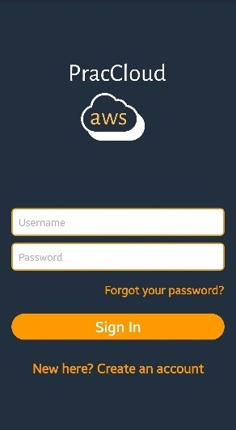
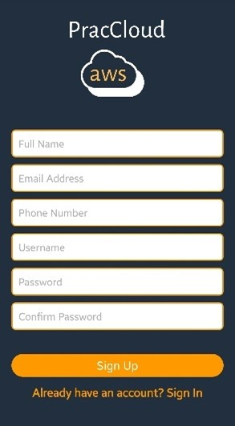

### Sidebar
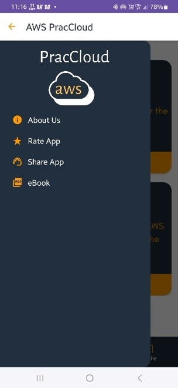

### About us
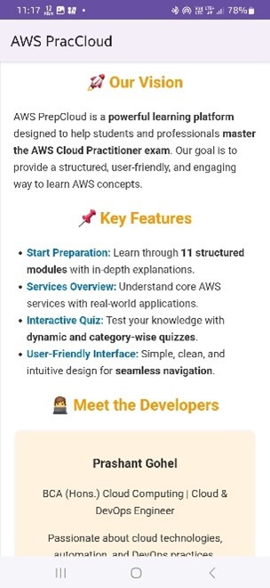

### Contact Us

### Rate app
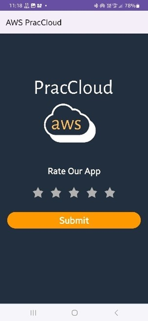

### Home Page
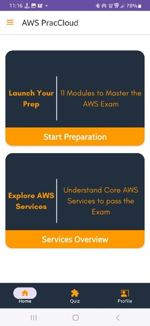

### Main Quiz Page
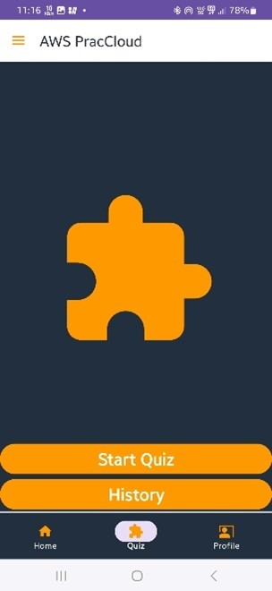

### Profile page

### Card 1 Modules
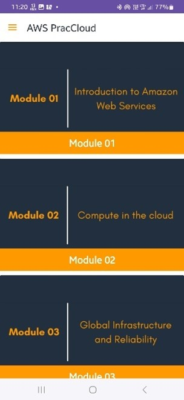

### Card 2 Topics
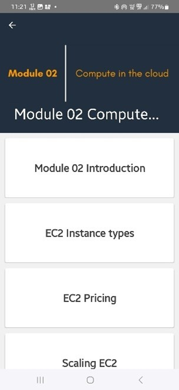

### Card 2 Services Overview
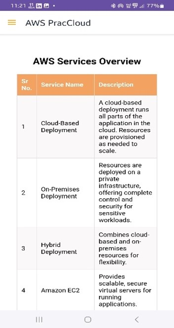

### Quiz Questions Page
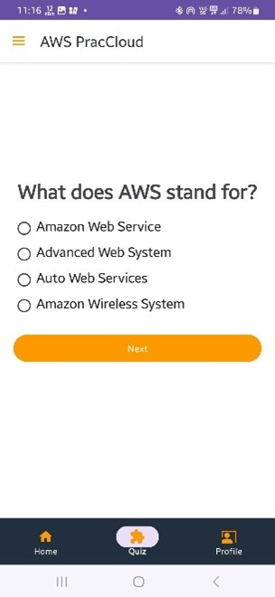

### Quiz History
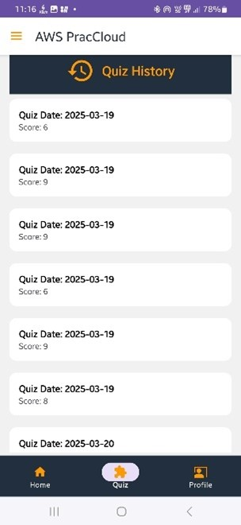
